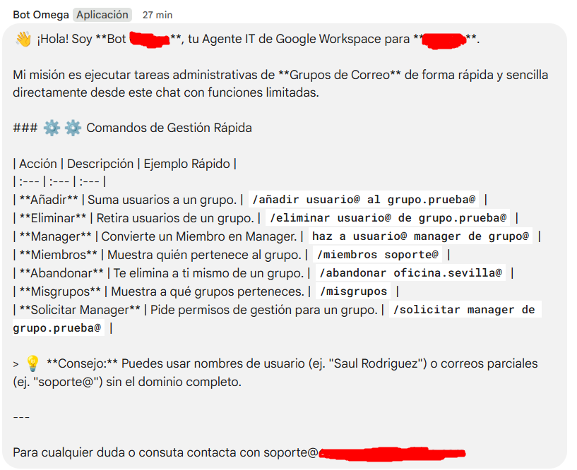
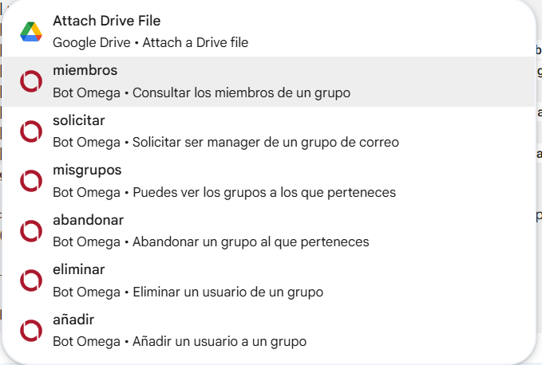

# Bot Omega: Google Workspace Group Management Agent

This is **Bot Omega**, a resilient chat tool designed to handle daily **Google Workspace Group administration** tasks (like managing members and roles) and act as a technical assistant by providing instant answers to FAQs.

The project combines Google Cloud's power: **Gemini AI** for understanding natural language and the precise execution capabilities of the **Admin SDK**.

---

## Core Capabilities

This bot is engineered for secure, efficient management across your domain:

* **Conversational Administration:** Users can simply type what they need (e.g., "add user@ to group.test@"). The **Gemini AI** interprets the intent behind the text.
* **Security First:** The sensitive Service Account keys are loaded securely at runtime via **Google Secret Manager (GSM)**, ensuring they are never exposed in code or variables.
* **Flexible Resolution:** The bot can find users and groups by accepting full emails, partial emails, or simply their display names (e.g., "Juan Pérez").
* **Quick Support (FAQs):** It answers support questions using a two-part strategy: first, a fast, direct lookup against the knowledge base, and then a **semantic fallback with Gemini** for complex queries.
* **Permission Control:** It enforces organizational rules, allowing group management only to approved **Managers, Owners**, or the Global Administrator.

---

## 📷 Bot Interface Preview

Here is a look at the command menu and the interaction workflow within Google Chat.

### Quick Command Menu


### Command Dropdown Interaction


---

## Technology Stack

The bot is designed on a modern, cloud-native architecture ready for serverless deployment:

| Technology | Role in the Project |
| :--- | :--- |
| **Node.js / Express** | Provides the execution environment and manages receiving chat events. |
| **Google Admin SDK** | The core library for performing the actual user and group management in Workspace. |
| **Google Secret Manager** | Secure handling of the Admin key used for domain delegation. |
| **Google Firestore** | Dynamically stores the AI prompts and the structured FAQ database. |
| **Gemini API** | The AI engine for natural language understanding and semantic search. |

---

## 💾 Firestore Configuration

### FAQ Data Structure

The bot relies on a specific structure where the content is stored as a JSON string within a document.

* **Collection:** `faq`

**Configuration Process**

1.  Write your FAQ content following the JSON array format below.
2.  In the Firestore console, create a collection named `faq`.
3.  Create a new document and add the field **`faq_documentation`**. Paste the complete JSON content as a **String value**.

```json
[
  {
    "id": 1,
    "category": "Access and Passwords",
    "questions": ["How can I reset my password?", "I forgot my key."],
    "keywords": ["reset", "password", "key"],
    "standard_answer": "To reset your password, you must go to the self-service portal...",
    "detailed_steps": ["Visit the company's web portal.", "Click on 'Forgot my password'."]
  }
]
